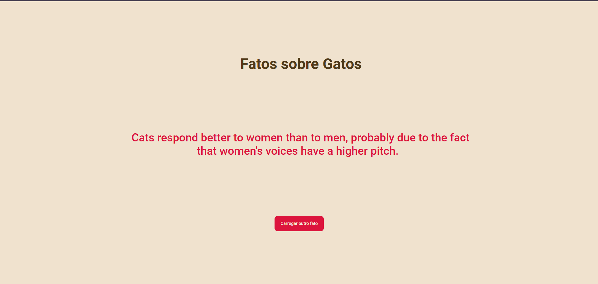

# cat-facts-api-react-native
> Uma API que gera fatos curiosos sobre gatos


## Pré-requisitos
É necessário ter:
  - Node - para rodar o projeto e utilizar as ferramentas do react e expo.
  - npm - para instalar recursos e depêndencias do projeto.
  - git - para o versionamento do código.
  - expo - para o processo de build do projeto.
  - Uma IDE de sua preferência.

### Como instalar o Node
#### Windows 
Entre no site do [Node](https://nodejs.org/pt-br/download) e baixe o arquivo msi

#### Linux
Utilize esses comandos no terminal:
```bash
# Baixar e instalar o nvm:
curl -o- https://raw.githubusercontent.com/nvm-sh/nvm/v0.40.3/install.sh | bash

# Carregar o nvm sem precisar reiniciar o shell
\. "$HOME/.nvm/nvm.sh"

# Baixar e instalar o Node.js:
nvm install 24

# Verifique a versão do Node.js:
node -v # Deve exibir "v24.15.0".

# Verificar a versão do npm:
npm -v # Deve imprimir "11.12.1".

```
### Como instalar o Expo
instale o expo globalmente utilizando o comando:
```bash
npm install -g expo-cli
```

### Como instalar o Git
Em qualquer sistema operacional, entre no site oficial do [Git](https://git-scm.com/install/) e siga os passos para o seu respectivo sistema operacional.

## Como rodar o projeto 
1. Clone este repositório.
   ```bash
   git clone https://github.com/GoBrazill/cat-facts-api-react-native.git
   ```

2. Entre na pasta do projeto.
   ```bash
   cd cat-facts-api-react-native
   ```

3. Instale as dependências do projeto.
   ```bash
   npm install
   ```

4. Confira que não a conflitos no projeto.
   ```bash
   npx expo-doctor
   ```
5. Rode o projeto.
   ```bash
   npx expo start
   ```

## Estrutura das pastas
```
├── src/
│   ├── assets/
│   │   └── icons/
│   │       └── favicon.png
│   ├── components/
│   │   └── .gitkeep
│   ├── layout/
│   │   └── .gitkeep
│   ├── services/
│   │   └── api.js
│   ├── styles/
│   │   └── GlobalStyles.js
│   ├── App.js
│   ├── app.json
│   └── index.js
├── .gitignore
├── package-lock.json
├── package.json
└── README.md
```
## Requisitos

### Funcionais
- RF 01 - Mostrar um fato ao rodar o projeto
- RF 02 - Ter um botão para gerar um novo fato

### Não funcionais
- RNF 01 - Conter um favicon e título na guia no navegador
- RNF 02 - Tempo de resposta para gerar um fato de menos de 1 segundo
- RNF 03 - Tratamento de erros de conexão com mensagens intuitivas para o usuário


## Ferramentas utilizadas


## Licença
Este projeto é de uso acadêmico e não possui fins comerciais.